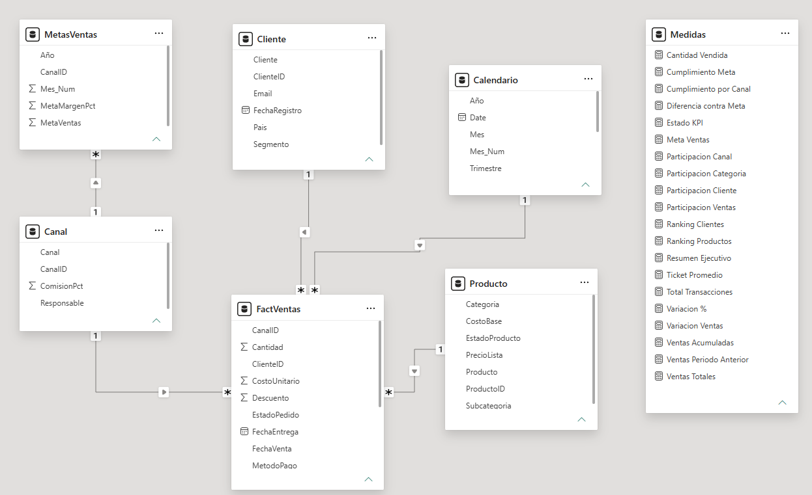

# 📊 Dashboard Ejecutivo de Análisis de Ventas

> Pipeline ETL completo · Modelo estrella · DAX avanzado · Inteligencia de tiempo

---

## 🛠️ Stack Tecnológico

| Herramienta | Uso |
|-------------|-----|
| **Power BI Desktop** | Visualización y dashboard ejecutivo interactivo |
| **Power Query (M)** | ETL, limpieza y transformación de datos |
| **DAX** | Medidas, KPIs, inteligencia de tiempo y texto dinámico |
| **Excel** | Fuente de datos origen con múltiples inconsistencias intencionales |

---

## 🎯 Objetivo

Desarrollo de un **dashboard ejecutivo de ventas** a partir de un dataset con múltiples inconsistencias de calidad de datos, aplicando un flujo completo de EDA, ETL en Power Query, modelado dimensional y análisis con DAX.

---

## ❓ Preguntas que responde este Dashboard
 
- ¿La empresa está cumpliendo las metas de ventas?
- ¿Qué canal de venta genera mayor volumen?
- ¿Cuál es el producto con mejor desempeño?
- ¿Cómo evolucionan las ventas mes a mes y frente al año anterior?
- ¿Qué vendedores y períodos presentan mayor o menor desempeño?

---

## 📁 Estructura del Repositorio

```
📦 dashboard-ventas-powerbi
├── 📊 Dasboard-ventas-powerBI.pbix
├── 📂 dataset/
│   └── proyecto_powerbi_avanzado_dirty.xlsx
├── 📂 screenshots/
│   └── pagina1_resumen_ejecutivo.png
│   └── pagina2_desempeno.png
│   └── pagina3_detalle_ranking.png
|   └── vista_de_modelo.png
└── 📄 README.md
```

---

## 🔍 EDA — Análisis Exploratorio Inicial
 
Antes de cualquier transformación se realizó un análisis del dataset crudo para identificar todos los problemas de calidad de datos:
 
### Dataset original — `FactVentas`
 
| Dimensión | Detalle |
|---|---|
| Tablas procesadas | 5 tablas (FactVentas, Cliente, Producto, Canal, MetasVentas) |
| Período | 2024 |
| Moneda | USD |
 
### Problemas detectados por tabla
 
| Tabla | Problema detectado |
|---|---|
| `FactVentas` | Valores con símbolos de moneda en campo numérico · Fechas con formatos mixtos · Texto y categorías inconsistentes |
| `Cliente` | Texto y categorías sin normalizar |
| `Producto` | Categorías sin estandarizar |
| `Canal` | Registros duplicados |
| `MetasVentas` | Categorías sin estandarizar |
 
---
 
## 🗃 Proceso ETL — Power Query (Lenguaje M)
 
Todo el proceso de limpieza se implementó paso a paso en Power Query para garantizar trazabilidad, reproducibilidad y auditoría de cada transformación.
 
### 🔄 Tabla `FactVentas`
 
- Corrección de valores con símbolos de moneda en campos numéricos
- Normalización de fechas con formatos mixtos
- Normalización de texto y categorías inconsistentes
### 🔧 Otras transformaciones
 
| Tabla | Transformación |
|---|---|
| `Cliente` | Normalización de texto y estandarización de categorías |
| `Producto` | Estandarización de categorías de producto |
| `Canal` | Eliminación de registros duplicados |
| `MetasVentas` | Estandarización de categorías para cruce con FactVentas |
 
---
 
## 🌟 Modelo de Datos y 📋 Descripción de Tablas
 
Arquitectura **modelo estrella** con tabla de hechos central y dimensiones de negocio:
 
Tabla de hechos
 
- FactVentas
Tablas de dimensión
 
- Cliente
- Producto
- Canal
- MetasVentas
Tabla dinámica
 
- Calendario (generada con rango dinámico de fechas)

Se adjunta imagen del modelo de datos y sus relaciones entre tablas, de **Uno a Varios (1:N)** entre dimensiones y tabla de hechos.


 
| Tabla | Tipo | Descripción |
|---|---|---|
| `FactVentas` | Hechos | Transacciones de ventas con monto, fecha, canal, vendedor y producto |
| `Cliente` | Dimensión | Información y segmentación de clientes |
| `Producto` | Dimensión | Catálogo de productos con categorías estandarizadas |
| `Canal` | Dimensión | Canales de venta (Online, Tienda física, etc.) |
| `MetasVentas` | Dimensión | Metas presupuestadas por período y vendedor |
| `Calendario` | Dimensión tiempo | Tabla de fechas con columnas Año, Mes, Trimestre, Date |

---

## 📐 Medidas DAX

Se hizo una documentación de la funcionalidad de cada una de las medidas DAX creadas, remitirse al enlace que se relaciona a continuación.

[📐 Medidas DAX](medidas_dax_documentacion.md)

---

## 🖥️ Dashboard

Dashboard ejecutivo de **3 páginas** con navegación mediante botones interactivos:

### Visuales incluidos
 
| Página | Nombre | Descripción |
|---|---|---|
| 1 | Resumen Ejecutivo | KPIs globales, cumplimiento de metas, evolución mensual de ventas |
| 2 | Desempeño | Análisis por vendedor, canal y producto |
| 3 | Detalle y Ranking | Tablas con ranking y detalle granular de transacciones |

### Imágenes del dashboard

### Página 1 — Resumen Ejecutivo


### Página 2 — Desempeño


### Página 3 — Detalle y Ranking


---

## 📋 Resultados & Hallazgos Clave

| Métrica | Resultado |
|---------|-----------|
| 🏆 Cumplimiento anual | **120.29%** — superó la meta |
| 🥇 Canal líder | **Online** con el 37.71% de las ventas |
| 💻 Producto estrella | **Laptop Pro 14** |
| 📉 Período más débil | **Q1 2024** |
| 🚀 Pico máximo | **Junio — $177K** |

---

## 🧠 Conclusiones
 
### Sobre la calidad de datos y el proceso ETL
 
El punto de partida del proyecto fue un dataset distribuido en 5 tablas con problemas heterogéneos: valores monetarios con símbolos en campos numéricos, fechas con formatos mixtos, categorías inconsistentes y registros duplicados. Esto exigió diseñar una estrategia de limpieza independiente por tabla en Power Query, manteniendo trazabilidad en cada paso. El proceso confirmó que en proyectos de análisis reales, la preparación del dato consume la mayor parte del esfuerzo antes de poder construir cualquier visualización.
 
### Sobre el modelo dimensional
 
La separación entre la tabla de hechos (`FactVentas`) y las dimensiones de negocio (Cliente, Producto, Canal, MetasVentas) permite filtrar y cruzar cualquier métrica de ventas desde múltiples perspectivas sin duplicar lógica. La tabla de calendario con rango dinámico de fechas es la columna vertebral de las medidas de inteligencia de tiempo y garantiza que los cálculos YTD y MoM funcionen correctamente independientemente del período filtrado.
 
### Sobre las medidas DAX
 
El proyecto aplica patrones DAX orientados al negocio comercial: comparación de ventas reales contra metas, ranking de vendedores y canales, y generación de texto narrativo automático. El uso de inteligencia de tiempo (YTD, MoM) permite que el dashboard comunique tendencias, no solo totales, lo que lo hace útil para decisiones operativas y no solo para reportes históricos.
 
### Aprendizajes técnicos clave
 
- Modelar `MetasVentas` como dimensión (en lugar de otra tabla de hechos) simplifica el cálculo de cumplimiento y evita ambigüedades en las relaciones del modelo.
- La tabla de calendario debe cubrir todo el rango de fechas del dataset y estar marcada como tabla de fechas en Power BI para que las funciones de inteligencia de tiempo operen correctamente.
- El insight dinámico generado por DAX transforma un dashboard técnico en una herramienta de comunicación ejecutiva, reduciendo la carga interpretativa del usuario final.
- La navegación por páginas mediante botones mejora la experiencia del usuario al guiar el análisis de lo general (resumen ejecutivo) hacia lo particular (detalle y ranking).

---

*Proyecto desarrollado como parte del portafolio de análisis de datos.*
