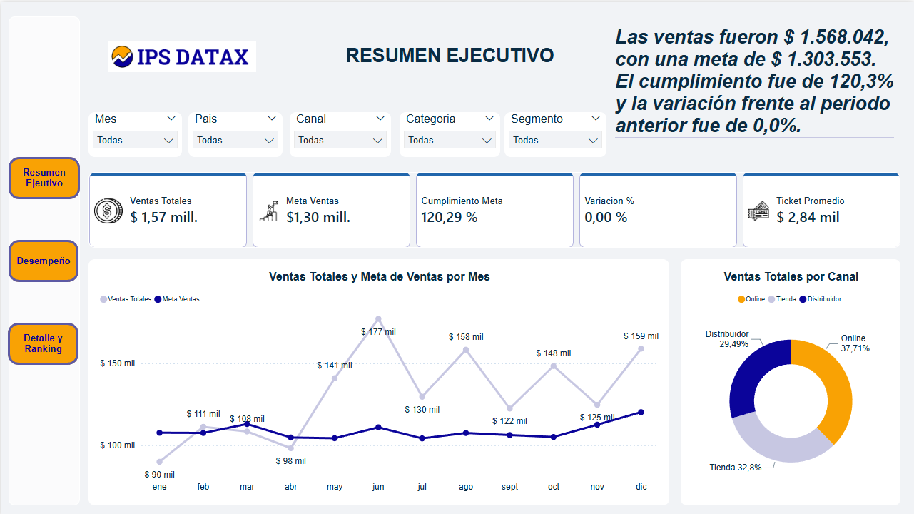
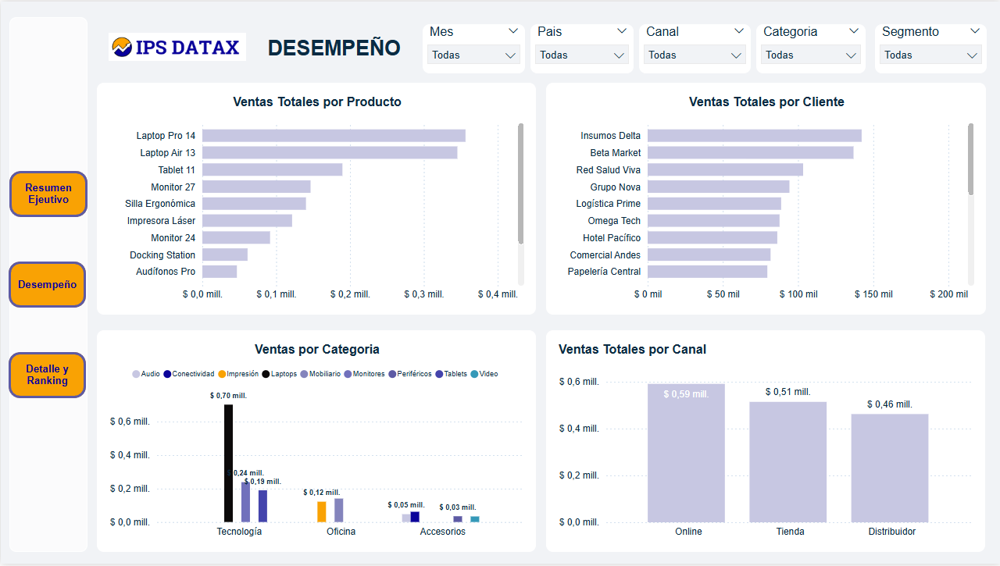
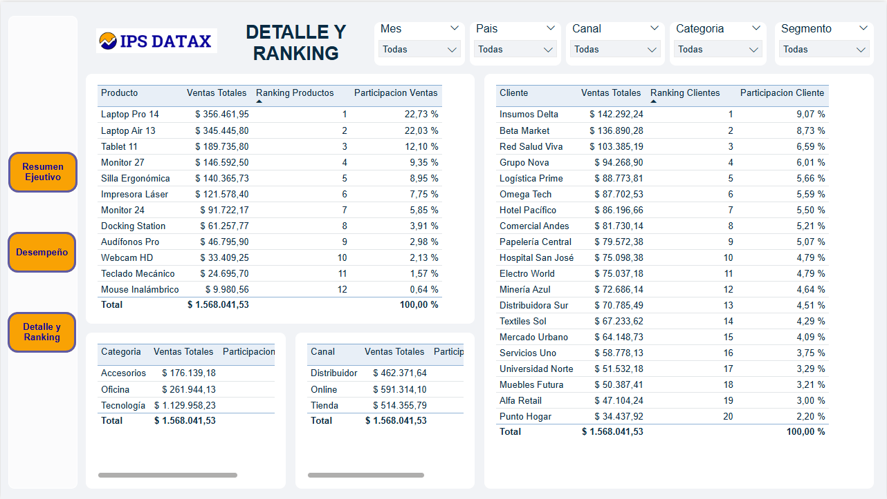

# Dashboard Ejecutivo de Análisis de Ventas

## Herramientas
Power BI · Power Query · DAX · Excel

## Objetivo
- Desarrollo de un dashboard ejecutivo interactivo a partir de un dataset con múltiples inconsistencias de calidad. 
- Realizar un proceso completo de ETL en Power Query, aplicando limpieza de textos, normalización de fechas con formatos mixtos, estandarización de categorías y corrección de valores numéricos con símbolos de moneda
- Construcción de un modelo estrella con tabla calendario.
- Creación de medidas DAX

## Proceso
- Limpieza de datos en Power Query (5 tablas): FactVentas, Cliente, Producto, Canal, MetasVentas
- Modelado estrella con tabla calendario
- Medidas DAX, incluyendo inteligencia de tiempo, KPIs de cumplimiento de metas y un insight dinámico con texto narrativo automático
- Dashboard ejecutivo 3 páginas, con navegación entre paginas por medio de botones

## Dashboard
### Página 1 — Resumen ejecutivo

### Página 2 — Desempeño

### Página 3 — Detalle y Ranking

## Conclusiones
- Cumplimiento anual: 120.29%
- Canal líder: Online con 37.71%
- Producto líder: Laptop Pro 14
- Período más débil: Q1 2024
- Pico máximo: Junio con $177K
>>>>>>> 716d18fcaa944a78b8b1ba31cd39ba82c202d22e
